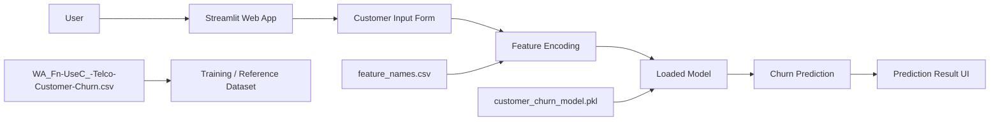
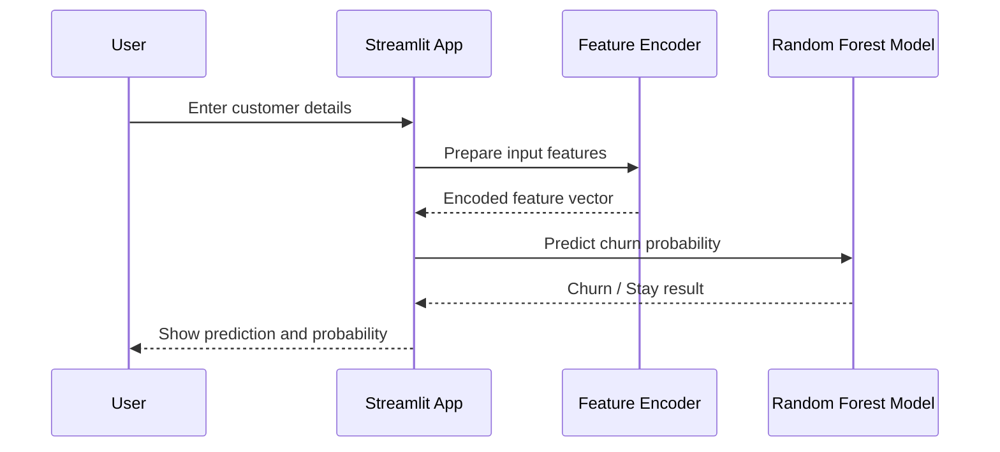
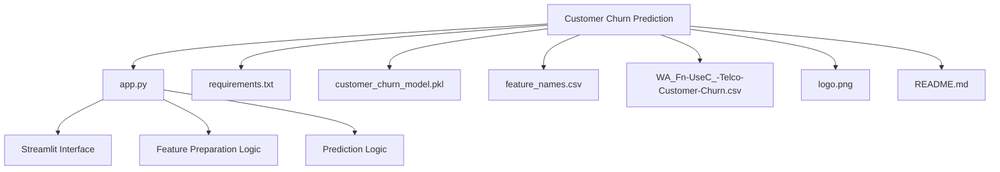
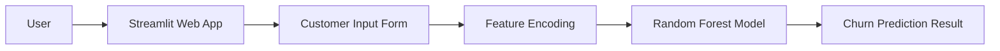

# Customer Churn Prediction

This project is a Streamlit-based machine learning application that predicts whether a telecom customer is likely to churn.

## Project Overview



## Prediction Workflow



## Repository Structure



## Suggested GitHub README Section

You can paste the following snippet directly into your GitHub README:

```md
## Architecture Diagram


```
